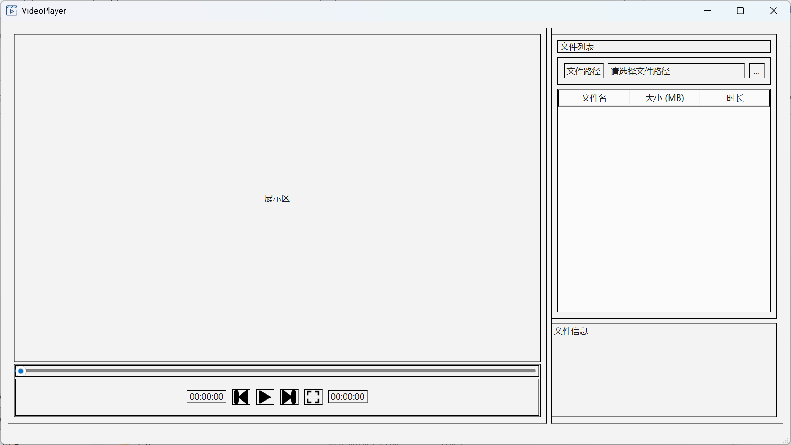
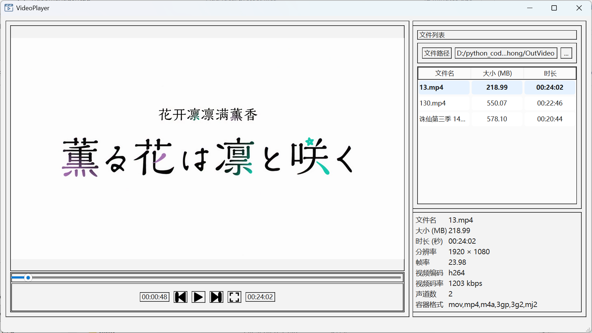

# 一个 Windows平台 基于QT 6.7.0 和 FFmpeg 8.0 的 C++ 视频播放器

## 功能实现
---

| 功能       | 描述             |   备注     |
|------------|----------------|---------------|
| 选中对应的文件夹 | 打开文件路径选择框  | 打开文件夹时不会直接显示内部包含的视频文件，当选中后会读入视频列表 | 
| 视频播放   | 在文件项中双击选中目标文件  | 无 |
| 播放切换 | 存在按钮可以直接切换 | 快捷键 [：上一个 ； ]：下一个 |
| 快进播放 | 可以移动多秒也可以直接拖动进度条 | 左箭头： 后退 **5** 秒 ； 右箭头： 快进**10**秒 |
| 全屏模式 | 点击按钮或使用快捷键 | 回车键可切换显示状态，全屏模式下Esc键可以退出 |

---
## v1.0 界面展示

---
## 补充说明
- 当切换显示模式时可能会出现，全屏显示模式下图像大小不变的可能，此时需要点击播放视频，将在下一帧自动调整到合适大小
- 当视频播放至末尾时，播放状态按钮仍然可以切换状态，此为正常现象，为了保证在播放到末尾时可以回退到之前的内容，避免开销
