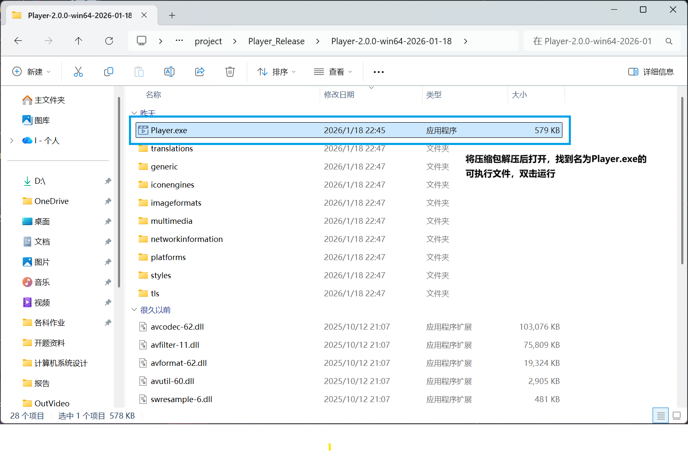
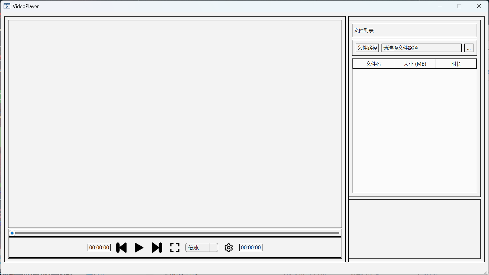
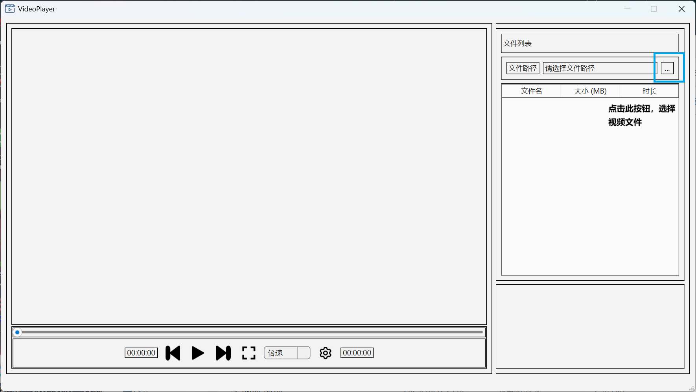
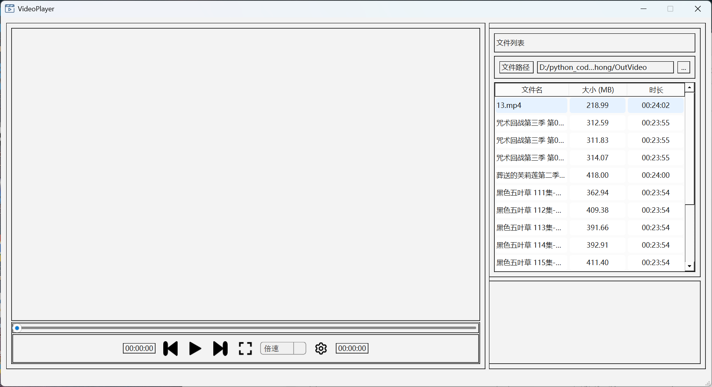
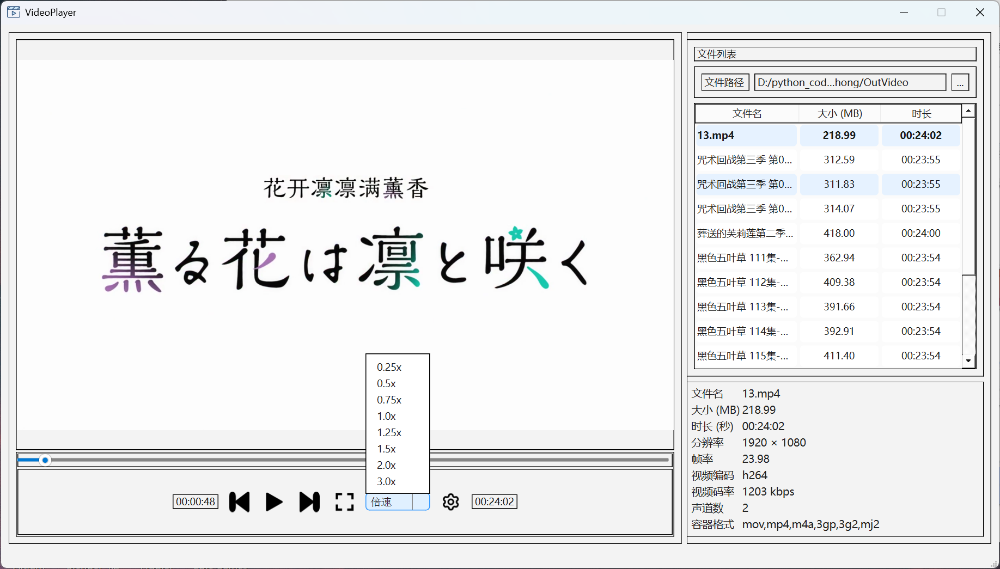
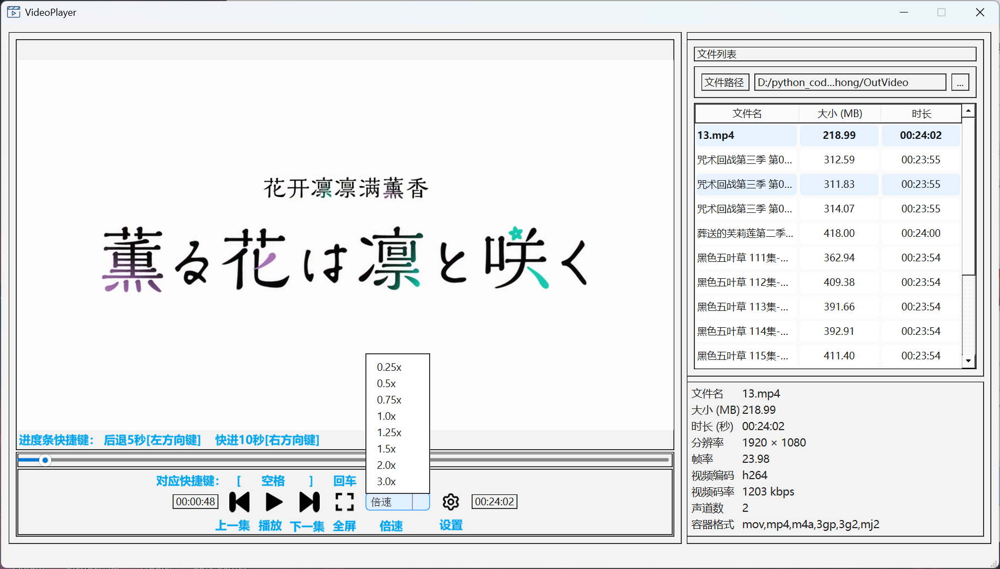
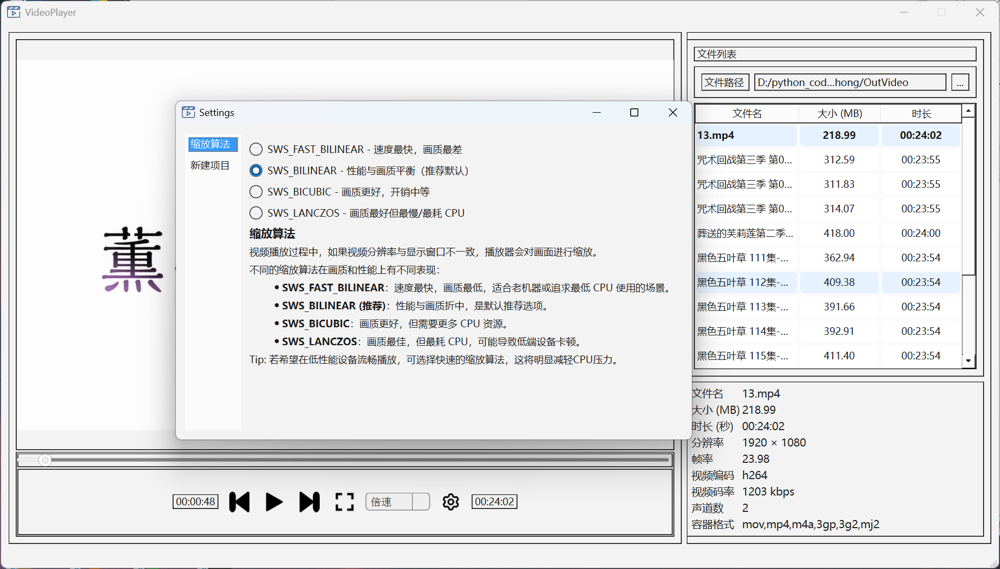

# 一个 Windows平台 基于QT 6.7.0 和 FFmpeg 8.0 的 C++ 视频播放器

---
## 目录
- [一个 Windows平台 基于QT 6.7.0 和 FFmpeg 8.0 的 C++ 视频播放器](#一个-windows平台-基于qt-670-和-ffmpeg-80-的-c-视频播放器)
  - [目录](#目录)
  - [功能实现](#功能实现)
  - [v2.0.0 使用教程](#v200-使用教程)
  - [快捷键一图流](#快捷键一图流)
  - [补充说明](#补充说明)

---
## 功能实现

| 功能       | 描述             |   备注     |
|------------|----------------|---------------|
| 选中对应的文件夹 | 打开视频文件路径选择框  | 当选中视频文件后会读入该文件夹下所有的视频 | 
| 视频播放   | 在文件项中双击选中目标文件  | 无 |
| 播放切换 | 存在按钮点击可以直接切换 | 快捷键 [：上一个 ； ]：下一个 |
| 快进播放 | 可以移动多秒也可以直接拖动进度条 | 左方向键： 后退 **5** 秒 ； 右方向键： 快进**10**秒 |
| 全屏模式 | 点击按钮或使用快捷键 | 回车键可切换显示状态，全屏模式下Esc键可以退出 |
| 倍速播放 | 在倍速按钮中选择合适的播放速度 | 不建议倍速选择太大，倍速越大对CPU负载越高 |
| 缩放质量自定义 | 在设置中可以调节采用的缩放算法 | 视个人计算机性能合理选择，画面质量越高，CPU负载越高，详见设置页面 |

---
## v2.0.0 使用教程
1. 在此项目主页的 [Releases](https://github.com/Liucxiong/Player/releases) 页面找到最新发布版本压缩包并下载到本地。
2. 将压缩包解压后打开，找到名为 **Player.exe** 的可执行文件，双击运行。

3. 这是主界面

4. 选择计算机中的视频文件

5. 将会自动加载该文件夹下的所有视频文件

6. 双击右侧列表中的任意视频文件即可播放视频

---
## 快捷键一图流

---
## 补充说明
- 当切换显示模式时可能会出现，全屏显示模式下图像大小不变的可能，此时需要点击播放视频，将在下一帧自动调整到合适大小
- 当视频播放至末尾时，播放状态按钮仍然可以切换状态，此为正常现象，为了保证在播放到末尾时可以回退到之前的内容，避免开销
- 对于部分视频连续不断的快进10秒可能会快进失败，稍等1秒左右即可恢复正常
