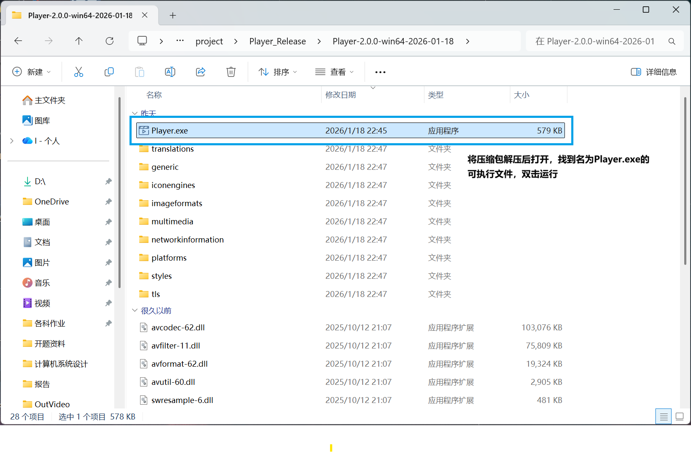
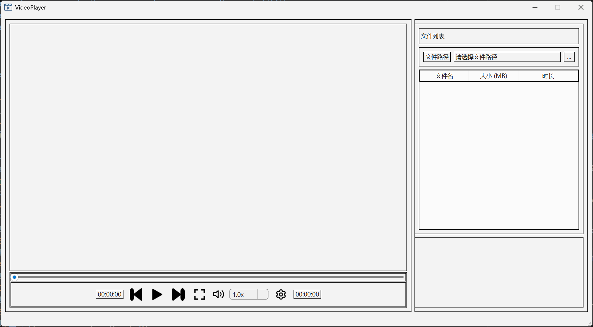
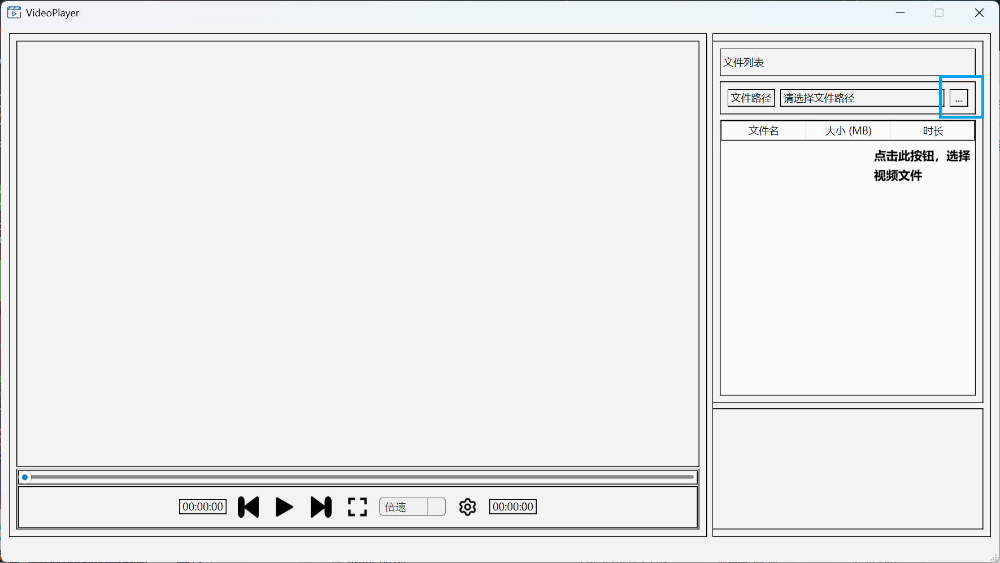
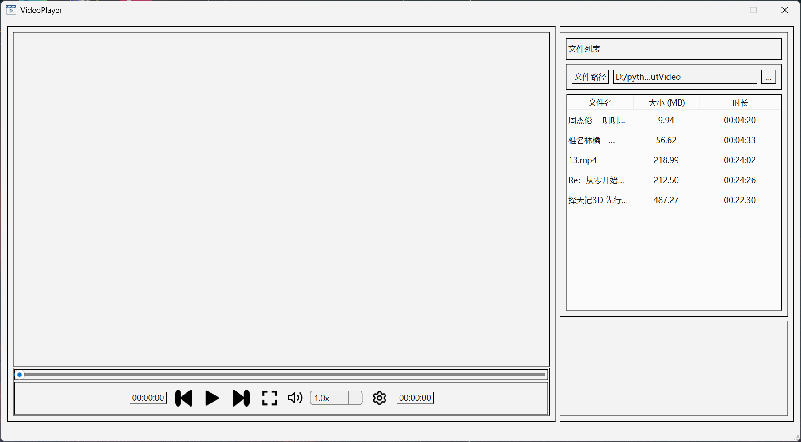
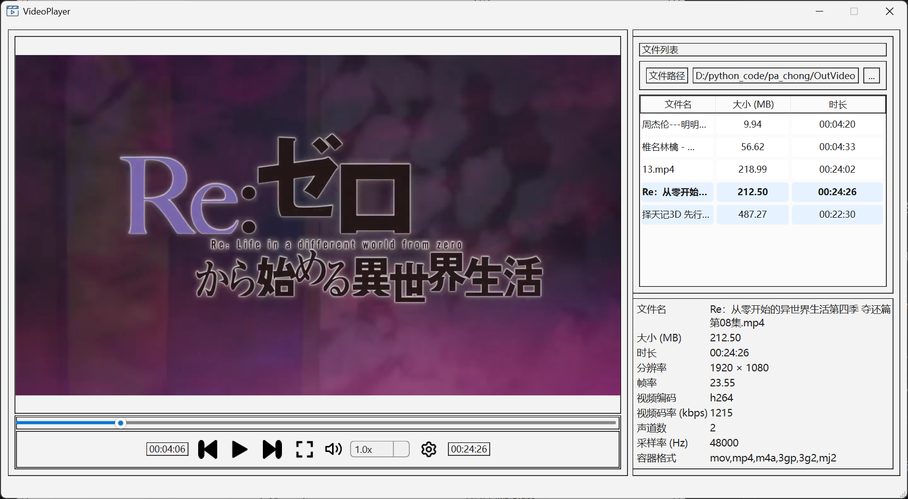
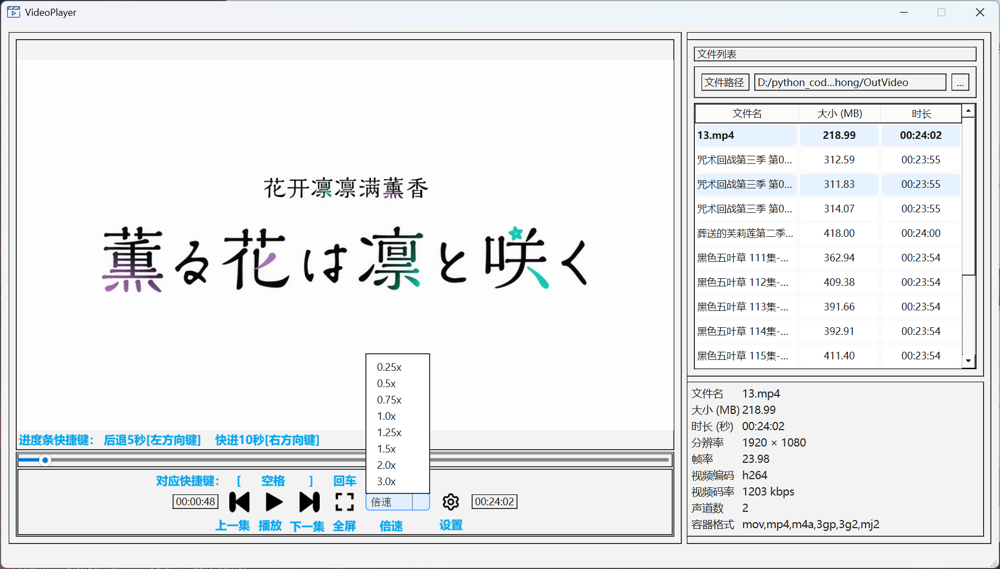
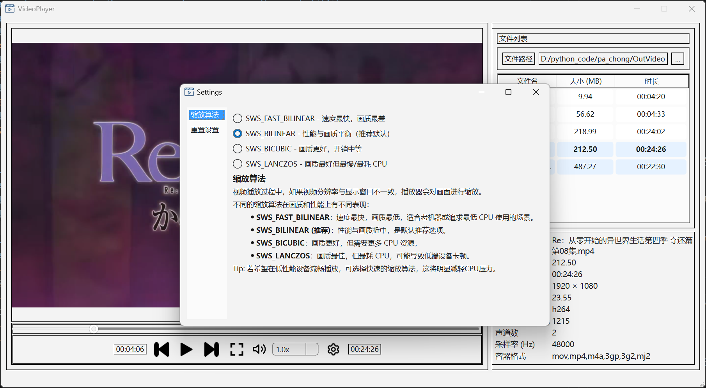

# 一个 Windows平台 基于QT 6.7.0 和 FFmpeg 8.0 的 C++ 视频播放器

---
## 目录
- [一个 Windows平台 基于QT 6.7.0 和 FFmpeg 8.0 的 C++ 视频播放器](#一个-windows平台-基于qt-670-和-ffmpeg-80-的-c-视频播放器)
  - [目录](#目录)
  - [功能实现](#功能实现)
  - [v2.1.0 更新内容](#v210-更新内容)
    - [新增功能](#新增功能)
    - [优化](#优化)
  - [v2.0.0 使用教程](#v200-使用教程)
  - [快捷键一图流](#快捷键一图流)
  - [补充说明](#补充说明)

---
## 功能实现

| 功能       | 描述             |   备注     |
|------------|----------------|---------------|
| 选中对应的文件夹 | 打开视频文件路径选择框  | 当选中视频文件后会读入该文件夹下所有的视频 | 
| 视频播放   | 在文件项中双击选中目标文件  | 无 |
| 播放切换 | 存在按钮点击可以直接切换 | 快捷键 [：上一个 ； ]：下一个 |
| 快进播放 | 可以移动多秒也可以直接拖动进度条 | 左方向键： 后退 **5** 秒 ； 右方向键： 快进**10**秒 |
| 全屏模式 | 点击按钮或使用快捷键 | 回车键可切换显示状态，全屏模式下Esc键可以退出 |
| 倍速播放 | 在倍速按钮中选择合适的播放速度 | 不建议倍速选择太大，倍速越大对CPU负载越高 |
| 缩放质量自定义 | 在设置中可以调节采用的缩放算法 | 视个人计算机性能合理选择，画面质量越高，CPU负载越高，详见设置页面 |
| 音量控制        | 通过音量按钮调节播放音量      | 支持 0～100 范围调节，静音时图标自动切换                      |
| 配置持久化      | 退出后自动保存当前所有设置    | 包含音量、速度、缩放算法、上次打开的文件夹、播放位置记忆      |
| 重置设置        | 在设置面板中一键恢复默认配置  | 重置前弹出确认框，重置时若正在播放会安全停止后清空            |

---
## v2.1.0 更新内容
 
### 新增功能
 
**音量控制与持久化**
- 新增音量调节按钮，支持 0～100% 范围调节
- 音量状态随其他配置一起持久化，重启后自动恢复上次设置值
- 拖动音量滑块时采用防抖机制（500ms 延迟写盘），避免频繁触发 I/O
**设置页面**
- 支持按下 `ESC` 快速关闭设置窗口
- 新增一键重置功能，可将所有设置恢复为默认值
  - 重置前弹出二次确认对话框，防止误操作
  - 若当前正在播放，重置时会先安全停止播放、退出全屏，再清空文件列表和路径，最后同步所有 UI 控件到默认状态
  - 重置完成后自动关闭设置窗口
### 优化
 
- **配置写入防抖**：音量、速度、缩放算法等高频操作改为延迟 500ms 写盘，退出时统一兜底保存，避免不必要的磁盘 I/O
- **重置安全性**：重置操作遵循"退出全屏 → 停止播放 → 清画面缓存 → 清 UI → 清数据 → 写盘 → 恢复默认值"的顺序，保证不会访问已释放的资源

---
## v2.0.0 使用教程
1. 在此项目主页的 [Releases](https://github.com/Liucxiong/Player/releases) 页面找到最新发布版本压缩包并下载到本地。(或者直接使用`.exe`后缀的安装包直接安装)
2. 将压缩包解压后打开，找到名为 **Player.exe** 的可执行文件，双击运行(可以为该文件创建快捷方式，复制到桌面方便使用)。

3. 这是主界面

4. 选择计算机中的视频文件

5. 将会自动加载该文件夹下的所有视频文件

6. 双击右侧列表中的任意视频文件即可播放视频

7. **卸载**：关闭程序后，直接将整个软件文件夹删除即可。(使用安装包安装则可在控制面板直接卸载程序)

---
## 快捷键一图流

---
## 补充说明
- 当切换显示模式时可能会出现，全屏显示模式下图像大小不变的可能，此时需要点击播放视频，将在下一帧自动调整到合适大小
- 当视频播放至末尾时，播放状态按钮仍然可以切换状态，此为正常现象，为了保证在播放到末尾时可以回退到之前的内容，避免开销
- 对于部分视频连续不断的快进10秒可能会快进失败，稍等1秒左右即可恢复正常
- 配置文件 `config.json` 保存在可执行文件所在目录，删除该文件即可手动重置所有配置